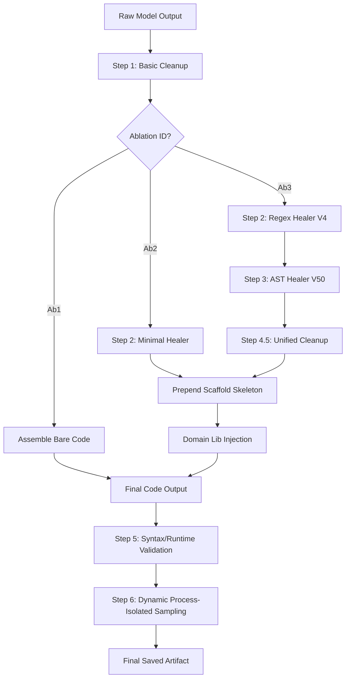

# 📊 Historical Healer Call Graph

This document details the exact execution sequence and call graph of the historical Healer pipeline, illustrating the transitions from raw model output to the final verified artifact across the three experimental ablation groups (Ab1, Ab2, and Ab3).

---

## 1. Monolithic Pipeline Execution Flow



---

## 2. Layer-by-Layer Execution Sequence and Properties

The table below lists each pipeline stage in the order of execution, its ablation specificity, and whether it performs deterministic transformations, modifies code structure, or invokes external model API calls.

| Stage | Name | Ablation | Type | Modifies Code | Modifies Display | Recomputes Answer | Sandbox Run | Model Calls |
| :--- | :--- | :--- | :--- | :---: | :---: | :---: | :---: | :---: |
| **0** | **Raw Model Output** | All | LLM Generation | No | No | No | No | **Yes** |
| **1** | **Basic Cleanup** | All | Deterministic | Yes | No | No | No | No |
| **2** | **Regex Healer** | Ab2 (Minimal) / Ab3 (Full) | Deterministic | Yes | No | No | No | No |
| **3** | **AST Healer** | Ab3 Only | Structural / Semantic | Yes | No | No | No | **Yes** (Rescue only) |
| **4.5**| **Unified Cleanup** | Ab3 Only | Deterministic | Yes | No | No | No | No |
| **Skeleton** | **Scaffold Assembly** | Ab2 / Ab3 | Template Prepend | Yes | No | No | No | No |
| **Injection**| **Domain Injection** | Ab2 / Ab3 | Regex Substitution | Yes | No | No | No | No |
| **5** | **Syntax/Runtime Validation** | Ab2 / Ab3 | Code Compilation | No | No | No | **Yes** | No |
| **6** | **Dynamic Sampling** | Ab2 / Ab3 | Process Sandbox | No | No | No | **Yes** (Timeout 5s) | No |
| **UI** | **Live Show Display Sanitizer** | Live Show UI Only | Regex Sanitizer | No | Yes | **Yes** | No | No |

---

## 3. Detail of Each Stage

### Stage 1: Basic Cleanup
*   **Ablation**: Executed for all groups (Ab1, Ab2, Ab3).
*   **Behavior**: Removes Markdown code fences (````python ... ````) and aggressively strips chatty intro/outro conversational texts (e.g. *"Here is the Python code..."*). It also executes `regex_healer_v2` to escape single-backslash LaTeX operators (like `\div`, `\times`) and protect them as raw strings `r"..."`.
*   **Model Call**: None.

### Stage 2: Regex Healer
*   **Ab2 (Minimal)**: Runs `heal_minimal` which only scans for missing dependencies and injects basic imports (e.g., `import random`, `import math`).
*   **Ab3 (Full)**: Runs `heal` which executes 15 distinct regex-based rewrite rules, including resolving mismatched parentheses, completing class prefixes (e.g., `simplify_term` -> `RadicalOps.simplify_term`), removing `input()` calls, and patching `correct_answer` assignment overrides.
*   **Model Call**: None.

### Stage 3: AST Healer
*   **Ablation**: Ab3 only.
*   **Static Phase**: Parses the code into an AST and applies structural rewrites (e.g., `^` -> `**`, dangerous `eval`/`exec` -> `safe_eval`, replacing hallucinated polynomial function names with `build_polynomial_text`, splitting incorrect `fmt_num` tuple assignments).
*   **Semantic Rescue Phase**: If static parsing or compilation fails, or if a sandbox dry-run returns an execution failure (e.g., `NameError`), the AST healer triggers `semantic_heal` which makes an **external model API call** supplying the error message to ask the LLM to self-heal the code block.
*   **Model Call**: **Yes**, only triggered if code fails compile/runtime checks.

### Stage 4.5: Unified Cleanup Healer
*   **Ablation**: Ab3 only.
*   **Behavior**: Scans the AST for duplicate definitions and removes variable shadowing or duplicate function/class declarations that could conflict with injected utilities.
*   **Model Call**: None.

### Scaffold Assembly & Domain Injection
*   **Ablation**: Ab2 and Ab3.
*   **Behavior**: Prepends the helper utility script (`PERFECT_UTILS` containing `to_latex`, `fmt_num`, etc.) to form a template. Then, `_inject_domain_libs` reads the standard implementations (e.g., `RadicalOps`, `PolynomialOps`) from `domain_function_library.py` and injects them, removing any stubs.
*   **Model Call**: None.

### Stage 5 & 6: Validation & Sampling
*   **Ablation**: Ab2 and Ab3.
*   **Behavior**: Compiles the code to check for syntax errors. Then, spawns a process-isolated subprocess with a 5-second timeout to execute `generate()` 3 times, checking for runtime exceptions or infinite loops.
*   **Model Call**: None.

### Live Show Display Sanitizer
*   **Ablation**: Not part of the offline code generation pipeline; only runs inside the `live_show.py` server API.
*   **Behavior**: Normalizes display formatting (collapses nested parentheses, wraps negative values in math strings, formats fractions). If the engine output is corrupted, it executes `recompute_result_answer` or switches to a deterministic fallback.
*   **Model Call**: None.
