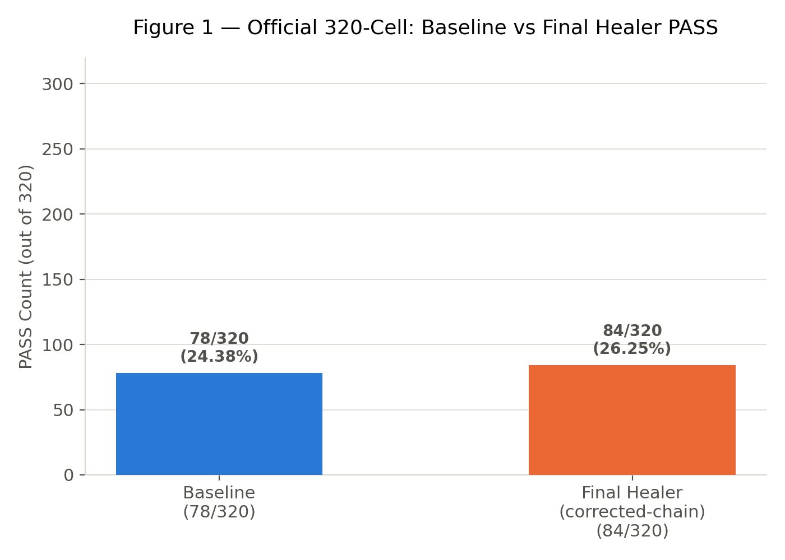
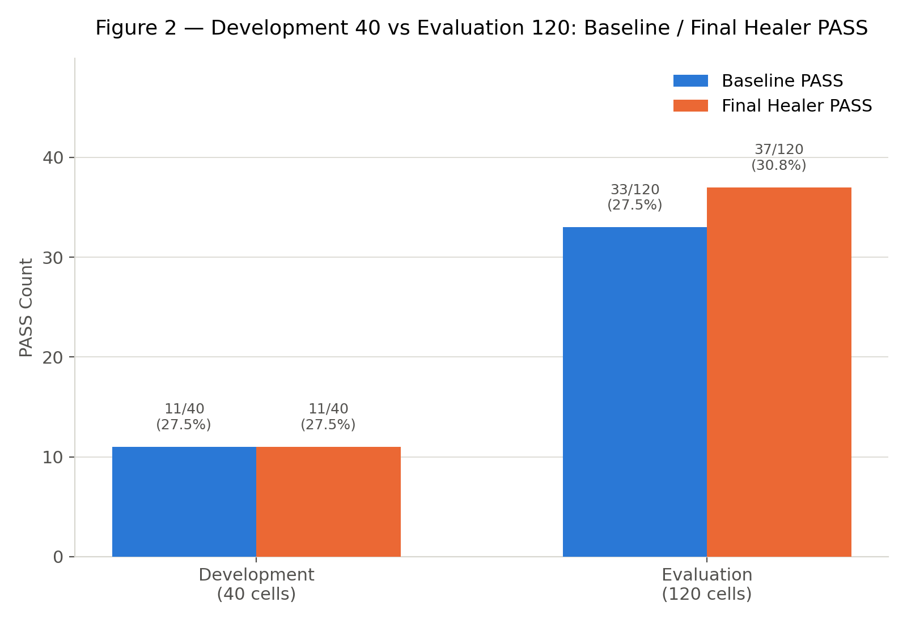
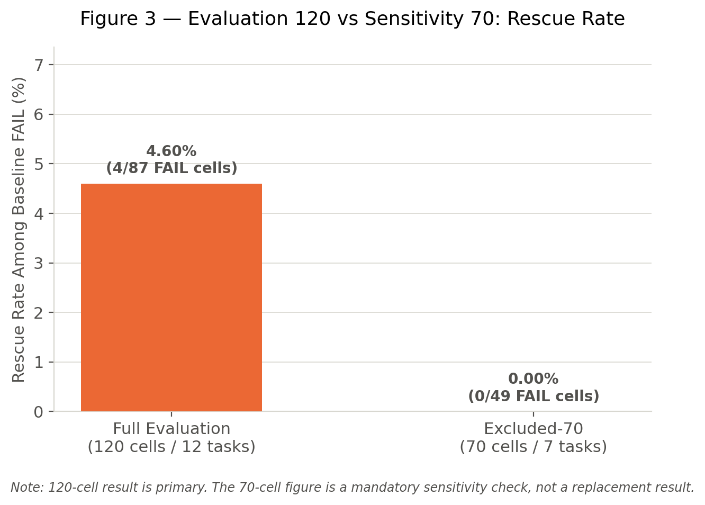
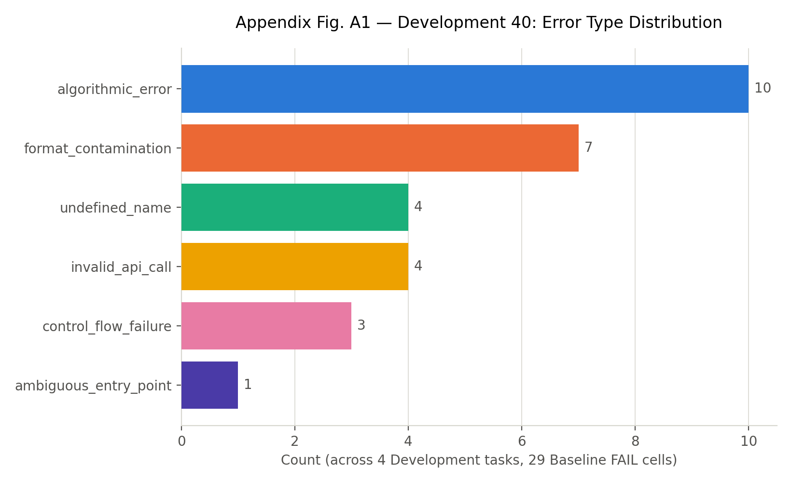
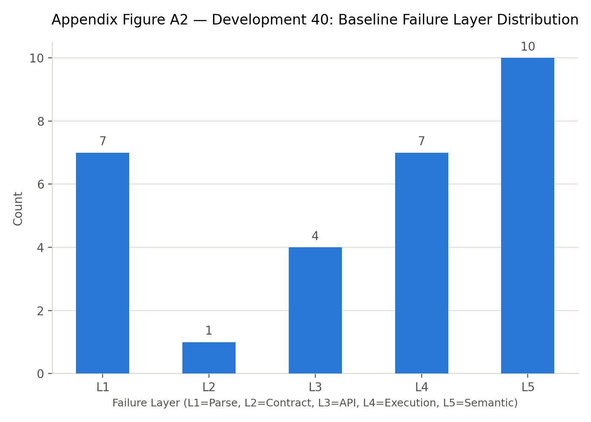

# Math16 Method 1 — 依 Development 40／Evaluation 120 切分成果報告

**Deterministic AST Healer Boundary Research Line**

報告日期：2026-07-28
資料來源：既有 Method 1（Qwen 3.5 4B）結果，全程未重跑模型／Healer／Evaluator
Split Manifest SHA-256: `c0ff7e8a31d713a92670aed1a03bc71429955c406036affdd8d9e216f1c9edc7`
更正說明：本報告官方 320 格總結果已依 [`math16_baseline_correction_note_v1.md`](math16_baseline_correction_note_v1.md) 更新為分析/報告層更正後數值（Baseline 79/320，corrected-chain Final 85/320）；40／120 切分子集數字（本更正之單一 cell 屬 `ab1` 條件，不在本切分之 `ab2d`／`ab2d_spec_v2` 範圍內）不受影響，維持不變。

---

## 1. 一頁式成果摘要 (Executive Summary)

本報告完全基於既有 Method 1（Qwen 3.5 4B）評估與 Healer 結果進行切分整理與統計聚合，全程不重跑模型、Healer 或 Evaluator，不新增結果判定。

### 官方 320 格總結果（Baseline vs 最終技術修正結果，分析/報告層更正後）

| | Baseline PASS | 最終技術修正結果 PASS | 共救回格數 | PASS rate |
|---|---|---|---|---|
| 官方 320 格 (Qwen 4B，更正後) | 79 / 320 | 85 / 320 | 6 格 | 24.69% → 26.56% |

> 最終技術修正結果採 corrected-chain（事後機制驗證）結果。依 [`math16_baseline_correction_note_v1.md`](math16_baseline_correction_note_v1.md)，分析/報告層 Baseline 由 78/320 更正為 79/320（+1 格，root cause 詳見該文件），Primary 正式結果對應由 83/320 更正為 84/320（現列為歷史中繼值，demoted，不再作為主表標題數字），corrected-chain 最終結果由 84/320 更正為 85/320；共救回格數維持 6 格不變。**凍結管線歷史輸出 Baseline 78/320、Primary 83/320、corrected-chain 84/320 永久保留於凍結證據檔內，不因本更正而修改**，完整分帳見附錄 A。Regression: Not measured under Method 1（Method 1 未對 Baseline PASS cells 執行 Healer，因此不能量測 PASS→FAIL regression）。

### Contract-Aware 160 格切分總覽（僅 ab2d + ab2d_spec_v2）

| 切分 | Total | Baseline PASS | 最終技術修正結果 PASS | PASS rate | Rescue rate (among FAIL) |
|---|---|---|---|---|---|
| Development (4 題) | 40 | 11 | 11 | 27.5% → 27.5% | 0% |
| Evaluation (12 題) | 120 | 33 | 37 | 27.5% → 30.83% | 4.6% |
| **合計 (16 題)** | **160** | **44** | **48** | **27.5% → 30%** | **3.45%** |

> Development 40 格中的 29 個 Baseline FAIL 案例，皆未命中現有 Generic Core 任一凍結規則的前置條件，因此沒有規則觸發、程式修改或救援。Evaluation 120 格中全部 4 格救援均落在 5 個 cohort_level_provenance_uncertain 任務內。

### Evaluation 敏感度分析：120 格（主要）vs 70 格（排除 5 uncertain 任務）

| | Total | Baseline PASS | 最終技術修正結果 PASS | PASS rate | Rescue rate (among FAIL) |
|---|---|---|---|---|---|
| **完整 Evaluation (主要結果)** | 120 | 33 | 37 | 27.5% → 30.83% | 4.6% |
| 排除-70 (敏感度分析) | 70 | 21 | 21 | 30% → 30% | 0% |

> 120 格為主要結果，70 格僅為敏感度分析，不得取代主結果。排除 5 個 cohort_level_provenance_uncertain 任務後，Evaluation 內 100% 的救援效果（4 格）消失，顯示本次 Healer 救援效果完全集中在 provenance 不確定任務內。

---

## 2. 320 格官方總結果 (Official 320-Cell Results)

以下數字取自既有 Method 1 正式凍結結果（Qwen 3.5 4B，320 cells = 16 題 × 4 條件 × 5 種子），未經任何重新計算或重跑；表中數值為分析/報告層更正後版本（依 [`math16_baseline_correction_note_v1.md`](math16_baseline_correction_note_v1.md)），凍結證據檔本身仍永久保留原始 78/83/84 數值（見表下注記與附錄 A）。

| 項目 | Baseline PASS | 最終技術修正結果 PASS (corrected-chain) | 共救回格數 | PASS rate |
|---|---|---|---|---|
| **Qwen 3.5 4B (320 cells，更正後)** | **79 / 320** | **85 / 320** | **6 格** | **24.69% → 26.56%** |

### 表下注記

- 「最終技術修正結果」欄位採用 corrected-chain（事後機制驗證後的最終結果），非 Primary 原始 5 格救援。
- **凍結管線歷史輸出（永久不變，見附錄 A）**：Baseline 78/320；Primary 正式預註冊結果 83/320（rescue = 5 格）；corrected-chain 事後驗證再增加 1 格達 84/320（rescue 共 6 格）。
- **分析/報告層更正後（依 Correction Note，本表採用）**：Baseline 79/320（+1 格，單一 cell 之候選程式擷取錨定錯誤，root cause 見 Correction Note）；Primary 對應為 84/320（歷史中繼值，demoted，不再作主表標題）；corrected-chain Final 85/320（rescue 仍為 6 格，該更正 cell 非 Eligible，不影響 rescue 計數）。Primary／corrected-chain 之詳細分帳與技術修正歷史，見附錄 A。
- Method 1（Deterministic AST Healer）僅針對 Baseline FAIL 案例執行 Eligibility 審查與修復介入。Regression: Not measured under Method 1（Method 1 未對 Baseline PASS cells 執行 Healer，因此不能量測 PASS→FAIL regression）。

---

## 3. 40／120 切分總結果 (Contract-Aware 160-Cell Split Results)

本節僅納入 Contract-Aware 40/120 Task-Level Split 所定義之 ab2d 與 ab2d_spec_v2 兩條件，5 個種子，合計 160 cells（16 題 × 2 條件 × 5 種子）。此 160 格為既有 320 格官方結果的子集切分，非新實驗。

### 3.1 Development（4 題，40 格）

| Total cells | Baseline PASS | Baseline FAIL | 技術修正救援 | 最終技術修正結果 PASS | PASS rate |
|---|---|---|---|---|---|
| **40** | **11** | **29** | **0** | **11** | **27.5% → 27.5%** |

Rescue rate among Baseline FAIL: 0%（29 格 Baseline FAIL 中，0 格被救援）

### 3.2 Evaluation（12 題，120 格）

| Total cells | Baseline PASS | Baseline FAIL | 技術修正救援 | 最終技術修正結果 PASS | PASS rate |
|---|---|---|---|---|---|
| **120** | **33** | **87** | **4** | **37** | **27.5% → 30.83%** |

Rescue rate among Baseline FAIL: 4.6%（87 格 Baseline FAIL 中，4 格被救援）

### 3.3 合計（16 題，160 格）

| Total cells | Baseline PASS | Baseline FAIL | 技術修正救援 | 最終技術修正結果 PASS | PASS rate |
|---|---|---|---|---|---|
| **160** | **44** | **116** | **4** | **48** | **27.5% → 30%** |

Rescue rate among Baseline FAIL: 3.45%（116 格 Baseline FAIL 中，4 格被救援）

> 160 格為 320 格官方結果之子集切分（僅 ab2d + ab2d_spec_v2 條件），不得誤寫為 320 格全體結果。

---

## 4. Development 40 格分析 (Development Cohort Detailed Analysis)

> **Development evidence — 用於規則與 Guard 設計，不代表最終泛化成效。**

以下逐格與錯誤型態分析，範圍僅限 Development 40 格（4 題 × 2 條件 × 5 種子）。此分析用於支持規則／Guard 設計討論，不代表模型在未知題型上的最終泛化表現。

### 4.1 四個 Domain 分布與 Baseline PASS／FAIL

| Task ID (Domain) | Total | Baseline PASS | Baseline FAIL | PASS% |
|---|---|---|---|---|
| ce111_q08_polynomial_factor_parameter_recovery (Polynomial) | 10 | 4 | 6 | 40% |
| ce111_nonchoice_q01_part1_exponential_growth (Integer) | 10 | 5 | 5 | 50% |
| ce111_q05_exact_fraction_expression (Fraction) | 10 | 1 | 9 | 10% |
| ce111_q10_ordered_quadratic_roots_radical (Radical) | 10 | 1 | 9 | 10% |

### 4.2 Rule-Precondition Matched／Rule Triggered／Source Changed／No Applicable Frozen Rule

| Task ID | Rule-precondition matched | Rule triggered | Source changed | No applicable frozen rule | Rescued |
|---|---|---|---|---|---|
| ce111_q08_polynomial_factor_parameter_recovery | 0 | 0 | 0 | 6 | 0 |
| ce111_nonchoice_q01_part1_exponential_growth | 0 | 0 | 0 | 5 | 0 |
| ce111_q05_exact_fraction_expression | 0 | 0 | 0 | 9 | 0 |
| ce111_q10_ordered_quadratic_roots_radical | 0 | 0 | 0 | 9 | 0 |
| **合計 (40 格)** | **0** | **0** | **0** | **29** | **0** |

### 4.3 Final Verified Rescue／Repaired-Still-Fail

| Task ID | Final Verified Rescue | Repaired-Still-Fail |
|---|---|---|
| ce111_q08_polynomial_factor_parameter_recovery | 0 | 0 |
| ce111_nonchoice_q01_part1_exponential_growth | 0 | 0 |
| ce111_q05_exact_fraction_expression | 0 | 0 |
| ce111_q10_ordered_quadratic_roots_radical | 0 | 0 |
| **合計 (40 格)** | **0** | **0** |

> Development 40 格中的 29 個 Baseline FAIL 案例，皆未命中現有 Generic Core 任一凍結規則的前置條件（Rule-precondition matched = 0），因此沒有規則觸發（Rule triggered = 0）、程式修改（Source changed = 0）或救援（Rescued = 0）。ce111_q08 之 Forced Ambiguity 探索（見附錄 B）為獨立案例研究，非本表統計之一部分。本處的規則前置條件命中，與其他 Stress Test 中的 Guard-level safety eligibility 屬不同判定層級，不可直接比較。

### 4.4 錯誤類型分布與規則命中分布

錯誤類型（mechanism tag）與規則命中分布，統計範圍限 Development 40 格內之 29 個 Baseline FAIL 案例。圖表詳見附錄 C（Appendix Figures A1／A2）。

| Task ID | L1 | L2 | L3 | L4 | L5 |
|---|---|---|---|---|---|
| ce111_q08_polynomial_factor_parameter_recovery | 2 | 1 | 0 | 2 | 1 |
| ce111_nonchoice_q01_part1_exponential_growth | 0 | 0 | 0 | 1 | 4 |
| ce111_q05_exact_fraction_expression | 3 | 0 | 3 | 1 | 2 |
| ce111_q10_ordered_quadratic_roots_radical | 2 | 0 | 1 | 3 | 3 |

規則命中（Rule Hits）：40 格範圍內，所有 Baseline FAIL 案例之 Rule-precondition matched 皆為 0（No applicable frozen rule），因此無任何規則命中（rule_hits = 空集合）。此結果與既有 split 結構及 Generic Core 的已知命中分布一致：320 格全域內命中規則前置條件（Eligible，官方 Primary/Post-hoc 用語）之 10 格，全數落在 Evaluation 範圍內。本處的規則前置條件命中，與其他 Stress Test 中的 Guard-level safety eligibility 屬不同判定層級，不可直接比較。

---

## 5. Evaluation 120 格結果 (Evaluation Cohort Aggregate Results)

本節僅呈現既有結果之任務層級聚合，不執行任何新的 raw source、AST 或 failure-pattern 分析。

| Task ID | Total | Baseline PASS | Baseline FAIL | 技術修正救援 | 最終技術修正結果 PASS | Rescue rate (among FAIL) |
|---|---|---|---|---|---|---|
| ce111_q02_polynomial_division_remainder | 10 | 0 | 10 | 0 | 0 | 0% |
| ce111_q03_prime_factor_selection | 10 | 4 | 6 | 0 | 4 | 0% |
| ce112_q01_negative_integer_power | 10 | 5 | 5 | 0 | 5 | 0% |
| ce112_q04_radical_simplification * | 10 | 0 | 10 | 0 | 0 | 0% |
| ce112_q09_divisor_multiple_intersection | 10 | 5 | 5 | 0 | 5 | 0% |
| ce112_q12_independent_probability_fraction | 10 | 2 | 8 | 0 | 2 | 0% |
| ce113_q01_negative_fraction_subtraction * | 10 | 4 | 6 | 1 | 5 | 16.67% |
| ce113_q11_rationalize_denominator * | 10 | 3 | 7 | 0 | 3 | 0% |
| ce115_calc_exact_rational_expression_l1 * | 10 | 1 | 9 | 0 | 1 | 0% |
| ce115_calc_polynomial_division_l1 | 10 | 5 | 5 | 0 | 5 | 0% |
| ce115_calc_polynomial_factor_roots_l1 | 10 | 0 | 10 | 0 | 0 | 0% |
| ce115_calc_radical_simplification_l1 * | 10 | 4 | 6 | 3 | 7 | 50% |
| **合計 (120 格)** | **120** | **33** | **87** | **4** | **37** | **4.6%** |

> \* 標記任務屬 5 個 cohort_level_provenance_uncertain 任務（ce112_q04_radical_simplification, ce113_q01_negative_fraction_subtraction, ce113_q11_rationalize_denominator, ce115_calc_exact_rational_expression_l1, ce115_calc_radical_simplification_l1）。本表僅聚合既有已計算之 Baseline／Final 狀態，未對個別 cell 進行新的錯誤型態或 AST 分析。

---

## 6. 120／70 敏感度分析 (Sensitivity Analysis: Full-120 vs Excluded-70)

為檢視 5 個 cohort_level_provenance_uncertain 任務對 Evaluation 結果之影響，本節並列完整 Evaluation（120 格／12 題）與排除該 5 題後之 Evaluation（70 格／7 題標準基準任務）結果。

> 120 格為主要結果（Primary Result）。70 格僅為敏感度分析（Sensitivity Analysis），不得取代主要結果，亦不得單獨引用 70 格數字作為正式結論。

| | Baseline PASS | 技術修正救援 | 最終技術修正結果 PASS | PASS rate | Rescue rate (among FAIL) |
|---|---|---|---|---|---|
| **完整 Evaluation (120 格／12 題，主要結果)** | **33** | **4** | **37** | **27.5% → 30.83%** | **4.6%** |
| 排除-70 (70 格／7 題，敏感度分析) | 21 | 0 | 21 | 30% → 30% | 0% |

### 解讀

- 完整 120 格中，Healer 救援 4 格（rescue rate 4.60%），全部發生在 5 個 cohort_level_provenance_uncertain 任務內。
- 排除該 5 題後，剩餘 70 格（7 個標準基準任務）之 Baseline FAIL 案例中，Healer 救援效果為 0 格（rescue rate 0.00%）。
- 此結果與既有 split 結構及 Generic Core 的已知命中分布一致。Development 40 格未包含 5 個 cohort_level_provenance_uncertain 任務，因此未觀察到既有規則救援；Evaluation 120 格中的 4 格救援全部位於該 5 題。排除後 70 格救援為 0，主要用於揭露結果對任務組成的敏感性，不視為新的獨立發現。

---

## 7. 結論 (Conclusions)

基於既有 Method 1（Qwen 3.5 4B）結果之 Contract-Aware 40/120 切分整理，本報告得出以下結論：

- 官方 320 格結果（分析/報告層更正後）：Baseline 79/320 (24.69%) → 最終技術修正結果（corrected-chain）85/320 (26.56%)，共救回 6 格。凍結管線歷史輸出 Baseline 78/320、Primary 83/320、corrected-chain 84/320 永久保留不變，詳見 [`math16_baseline_correction_note_v1.md`](math16_baseline_correction_note_v1.md) 與附錄 A。Regression: Not measured under Method 1。
- Contract-Aware 160 格切分（僅 ab2d + ab2d_spec_v2）中，Development 40 格 Baseline PASS 11/40 (27.5%)，最終技術修正結果 PASS 同為 11/40 (27.5%)，救援效果為 0；Evaluation 120 格 Baseline PASS 33/120 (27.5%) → 最終技術修正結果 PASS 37/120 (30.83%)，救援 4 格。
- Development 40 格中，全部 29 個 Baseline FAIL 案例之 Rule-precondition matched 皆為 0（No applicable frozen rule），未觸發任何凍結規則；此支持 Development 集合作為規則／Guard 設計參考證據，而非泛化成效指標的定位。
- Evaluation 120 格為主要結果；排除 5 個 cohort_level_provenance_uncertain 任務後之 70 格敏感度分析顯示，全部 4 格救援效果均集中於該 5 題內，標準基準 7 題（70 格）救援效果為 0。
- Method 1（Deterministic AST Healer）僅針對 Baseline FAIL 案例執行安全介入。Regression: Not measured under Method 1（Method 1 未對 Baseline PASS cells 執行 Healer，因此不能量測 PASS→FAIL regression）。

*以上所有數字均直接取自既有正式凍結結果，全程未重跑模型、Healer 或 Evaluator，亦未新增任何結果判定。*

---

## 8. 表下注記與附錄 (Footnotes & Appendices)

### 附錄 A：Primary／Corrected-Chain 分帳歷史

為維護實證研究之嚴謹性，Primary 與 Post-hoc（Corrected-chain）數據嚴格分帳：

| 項目 | Baseline | Eligible | Primary Rescue/Final | Post-hoc Rescue/Final |
|---|---|---|---|---|
| Qwen 4B（凍結管線歷史輸出，永久保留） | 78/320 | 10 格 | 5 格 (83/320) | 6 格 (84/320) |

分帳原則（凍結歷史語意）：83/320 為事前預註冊 Protocol 唯一正式認可數據（Primary）。Post-hoc corrected-chain 84/320（相較 Primary 僅多 1 個 PASS）屬事後機制探索與 false-loop rollback bug 修正結果，不得冒充為 Primary 正式結果。

技術修正細節：在 10 個 Eligible 案例重放中，8 個處置狀態完全不變；2 個處置狀態改變（1 格由 no_op 改為 rescued 使 PASS 增加 1 格，1 格由 no_op 改為 repaired_still_fail 仍為 FAIL）。因此僅 1 格改變最終 PASS/FAIL 結果（83→84）。

> **分析/報告層更正後對應值（見 [`math16_baseline_correction_note_v1.md`](math16_baseline_correction_note_v1.md)）**：上表為凍結管線歷史輸出，永久保留、不予修改。經 Method 1／Method 2 差異 audit 確認一格獨立於 Eligibility 之外的 Baseline 擷取錯誤（`qwen3_5_4b__ce115_calc_polynomial_division_l1__ab1__seed_2026072003`，非 Eligible）後，分析/報告層對應更正為：Baseline 79/320、Eligible 10 格（不變）、Primary 84/320（歷史中繼值，demoted）、corrected-chain Final 85/320（rescue 仍為 6 格）。

### 附錄 B：ce111_q08 Forced Ambiguity 案例（Development 任務）

ce111_q08_polynomial_factor_parameter_recovery 於 Development 40 格中之 guard_related_exposure 分類，源自獨立的 Forced Ambiguity 探索案例研究（非本報告 Rule-precondition matched 統計之一部分）：

- 標的 Cell：`qwen3_5_4b__ce111_q08_polynomial_factor_parameter_recovery__ab2d__seed_2026072004`
- Evaluator 評估結果：FAILED (missing_entry_point)
- Safety 預分類：UNSAFE_MODIFICATION
- 防護語意：歧義閘門避免了一次事前無法證明安全、且實際未能救回程式的介入。

### 附錄 C：Development 40 格錯誤類型與規則命中圖表

### 附錄 D：方法學限制與範疇聲明

- 本報告所有數字嚴格限定於既有 Method 1（Qwen 3.5 4B，320 cells）已凍結結果之 Contract-Aware 40/120 切分整理，不代表新實驗、新結果判定或新的模型能力評估。
- 160 格為 320 格官方結果的子集（僅 ab2d + ab2d_spec_v2 條件），不得誤寫為 320 格全體結果。
- Development 40 格分析（含錯誤類型、規則命中）僅用於支持規則／Guard 設計討論，明確不代表模型在未知題型上的最終泛化成效。
- Evaluation 120 格結果僅為既有結果之任務層級聚合，未執行新的 raw source、AST 或 failure-pattern 分析。
- 70 格排除分析為強制性敏感度檢查（Mandatory Sensitivity Analysis），依 Governance 文件雙報義務要求並列呈現，不得取代 120 格主要結果。
- Method 1 之 Deterministic AST Healer 僅對 Baseline FAIL 案例執行安全介入。Regression: Not measured under Method 1（Method 1 未對 Baseline PASS cells 執行 Healer，因此不能量測 PASS→FAIL regression）。
- Ab1、Ab2g 條件與 Method 2、Stage2 均不在本報告範疇內。
- Split Manifest SHA-256：`c0ff7e8a31d713a92670aed1a03bc71429955c406036affdd8d9e216f1c9edc7`
