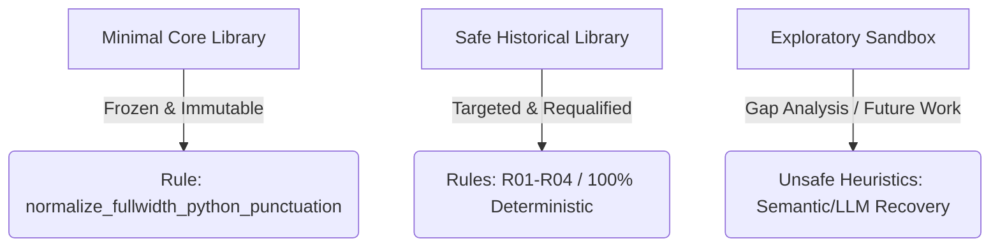

# 📜 Safe Historical Healer Governance & Freeze Specification

This document defines the architectural boundaries, execution order, convergence constraints, and validation schemas for the safe historical healer rules, freezing these definitions to prevent future regression.

---

## 1. Three-Layer Pipeline Split

The recovery pipeline enforces strict isolation between three layers of rules:



1.  **Minimal Core Library**: A frozen, immutable set of baseline rules. New runs must refer directly to the existing `core.normalize_fullwidth_python_punctuation` rule identity. Duplication of its logic is strictly prohibited.
2.  **Safe Historical Library**: A minimal, deterministic library reconstructed from audited, requalified rules (e.g., Markdown fence stripping, standard trailing cleanup). Rules must have 100% test coverage and zero semantic risk.
3.  **Exploratory Sandbox**: Rules containing semantic modifications, default variable injections, or external API model calls. **Exploratory findings are strictly prohibited from entering the formal applicability metrics, verified rescues, or main results tables.**

---

## 2. Execution Pipeline and Convergence Guarantees

### Execution Order
When active, the healer executes in a strict, single-pass pipeline:
1.  `R01_markdown_fence_removal`
2.  `R02_trailing_artifact_removal` (excluding truncated trailers)
3.  `R03_thinking_leakage_removal`
4.  `R04_fullwidth_punctuation_normalization` (calling the Minimal Core rule identity)
5.  `R05_empty_block_repairer` (inactive by default, as all candidates are deemed unsafe)

### Convergence Constraints
*   **Single-Pass Execution**: The pipe runs from step 1 to 5 exactly once.
*   **Second-Pass Convergence**: Applying the pipeline a second time to already healed code **must result in zero changes**. If a second pass alters the code, the run is flagged as `NON_CONVERGENT` and rejected from the formal replay.

---

## 3. Standardization and Schema Freezes

### RepairResult Schema
Every rule execution must return the following structured JSON output:
```json
{
  "rule_id": "string",
  "sequence_index": "int",
  "applied": "bool",
  "before_sha256": "string",
  "after_sha256": "string",
  "diff": "string (unified diff)",
  "reason": "string",
  "rejected_reason": "string or null",
  "semantic_risk": "low" | "medium" | "high",
  "evidence": "string"
}
```

### Verified Rescue Taxonomy
To prevent mathematical and semantic dilution, we freeze the following definitions:
*   **VERIFIED_RESCUE**: A candidate script that, after healing, successfully compiles, executes, and passes all evaluation gates G1 through G6a/G6b, achieving a final status of `PASS`.
*   **PARTIAL_REPAIR**: A script where a syntax failure (G1) is resolved, but execution fails in subsequent gates (G2-G4). This is counted as a failure and **must not** be categorized as a rescue.
*   **REGRESSION**: An occurrence where a script that previously passed a gate fails that gate after healing. The target rate for regressions in production runs is exactly **0**.
