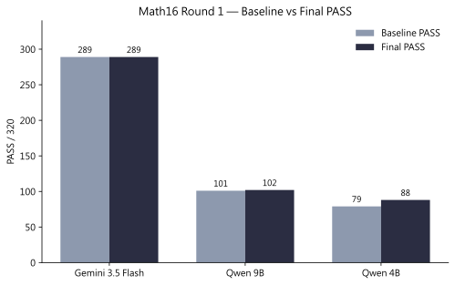
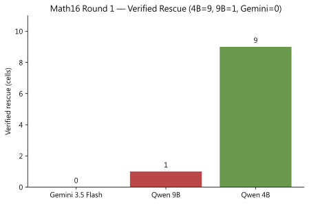
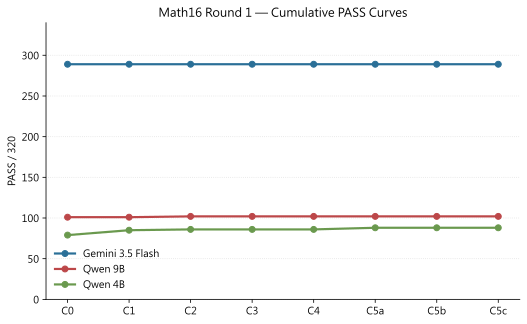
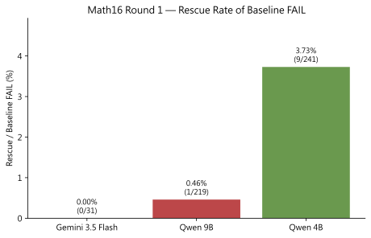

# Math16 三模型 Aggressive Healer Round 1 正式比較 v1

> **Round 角色：** Round 1 = **正式主分析（Primary formal analysis）**
> **Round 2：** **尚未執行**；若未來執行，僅作 post-hoc iterative replay，**不得覆寫 Round 1 主表**
> **Archive HEAD：** `e6ceffbd5601605d116a3a28ff38aa4b7542fc20`
> **Protocol：** 凍結規則 × FAIL-only × 單輪 Deterministic Healer（不呼叫模型）

---

## 1. 核心統計

| 模型 | Baseline PASS | Final PASS | verified rescue | Baseline FAIL | 修復率 | regression |
|---|---:|---:|---:|---:|---:|---:|
| Gemini 3.5 Flash | 289/320 | 289/320 | 0 | 31 | 0.00% | 0 |
| Qwen 9B | 101/320 | 102/320 | 1 | 219 | 0.46% | 0 |
| Qwen 4B | 79/320 | 88/320 | 9 | 241 | 3.73% | 0 |

修復率分母 = Baseline FAIL：

- Qwen 4B：`9/241 = 3.73%`
- Qwen 9B：`1/219 = 0.46%`
- Gemini：`0/31 = 0%`

## 2. Cumulative PASS 曲線

| 模型 | C0 | C1 | C2 | C3 | C4 | C5a | C5b | C5c |
|---|---:|---:|---:|---:|---:|---:|---:|---:|
| Gemini 3.5 Flash | 289 | 289 | 289 | 289 | 289 | 289 | 289 | 289 |
| Qwen 9B | 101 | 101 | 102 | 102 | 102 | 102 | 102 | 102 |
| Qwen 4B | 79 | 85 | 86 | 86 | 86 | 88 | 88 | 88 |

## 3. 正式主結論

在同一套凍結、FAIL-only、單輪 Deterministic Healer 下，Qwen 4B、Qwen 9B 與 Gemini 分別獲得 9、1、0 格 verified rescue；以 Baseline FAIL 為分母，修復率分別為 3.73%、0.46% 與 0%。在本次三模型與 16 題實驗範圍內，Baseline 表現較高的模型，其殘餘失敗較少命中現有 frozen rules 的安全修復窗口。此結果顯示 Healer 效益與 residual failure type 及規則適配程度密切相關，但不宣稱模型規模與修復率存在普遍因果關係。三模型 regression 均為 0。

## 4. Round 邊界

| 項目 | 狀態 |
|---|---|
| Round 1 | **正式主分析**（本文件） |
| Round 2 | **尚未執行** |
| 未來 Round 2（若執行） | 僅 post-hoc iterative replay |
| Round 2 可否覆寫 Round 1 主表 | **否** |

## 5. 圖表

| 圖 | 路徑 |
|---|---|
| Baseline vs Final | `docs/決賽文件/實驗結果文件/Math16/figures/figure_07_round1_baseline_vs_final.svg` |
| Verified rescue | `docs/決賽文件/實驗結果文件/Math16/figures/figure_08_round1_verified_rescue.svg` |
| PASS 曲線 | `docs/決賽文件/實驗結果文件/Math16/figures/figure_09_round1_pass_curves.svg` |
| Rescue rate | `docs/決賽文件/實驗結果文件/Math16/figures/figure_10_round1_rescue_rate.svg` |
| 圖表資料 | `docs/決賽文件/實驗結果文件/Math16/figures/round1_chart_data_v1.json` |

## 6. 來源追溯

### Gemini 3.5 Flash

- Authority note：gemini_fail_gated_authoritative_v1 FAIL-only C0→C5c
- `docs/experiments/manifests/math16_cumulative_summary_gemini_fail_gated_authoritative_v1.json`
- `docs/experiments/manifests/math16_c5a_c5c_tier_d_d5_d2_chain_gemini_fail_gated_authoritative_v1.json`

### Qwen 9B

- Authority note：qwen9b_fail_gated_authoritative_v1 FAIL-only C0→C5c
- `docs/experiments/manifests/math16_c0_c4_fail_gated_authoritative_chain_qwen9b_fail_gated_authoritative_v1.json`
- `docs/experiments/manifests/math16_c5a_c5c_tier_d_d5_d2_chain_qwen9b_fail_gated_authoritative_v1.json`
- `docs/決賽文件/實驗結果文件/Math16/07_math16_qwen9b_aggressive_healer_round1_handoff_v1.md`

### Qwen 4B

- Authority note：4B cumulative FAIL-only Round 1 (Method2／Development closures under _v1); headline from sealed handoff
- `docs/決賽文件/實驗結果文件/Math16/06_math16_aggressive_healer_current_handoff_v1.md`
- `docs/experiments/manifests/math16_c5a_final_source_closure_v1.json`

## 7. 聲明

- 未執行 Round 2
- 未呼叫模型
- 未修改 frozen rules／guard／threshold／order
- 未修改既有 4B／9B／Gemini 原始 artifacts（本輪僅新增比較封存產物與既有 Gemini Round 1 untracked 產物入庫）

